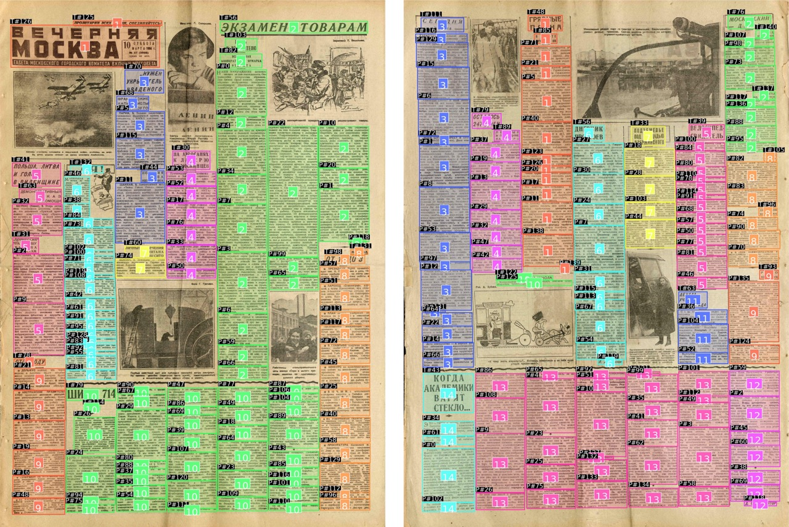
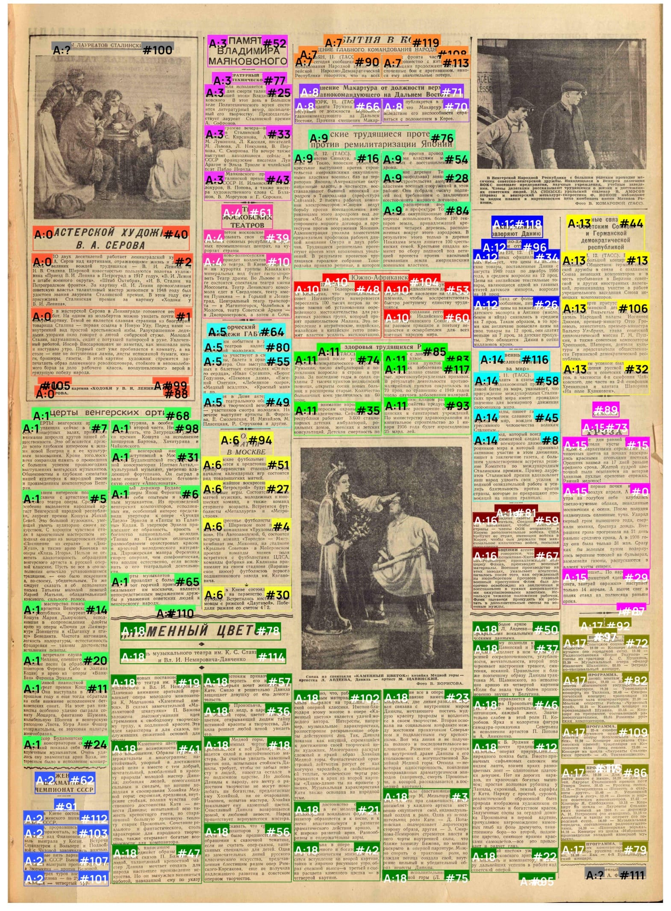
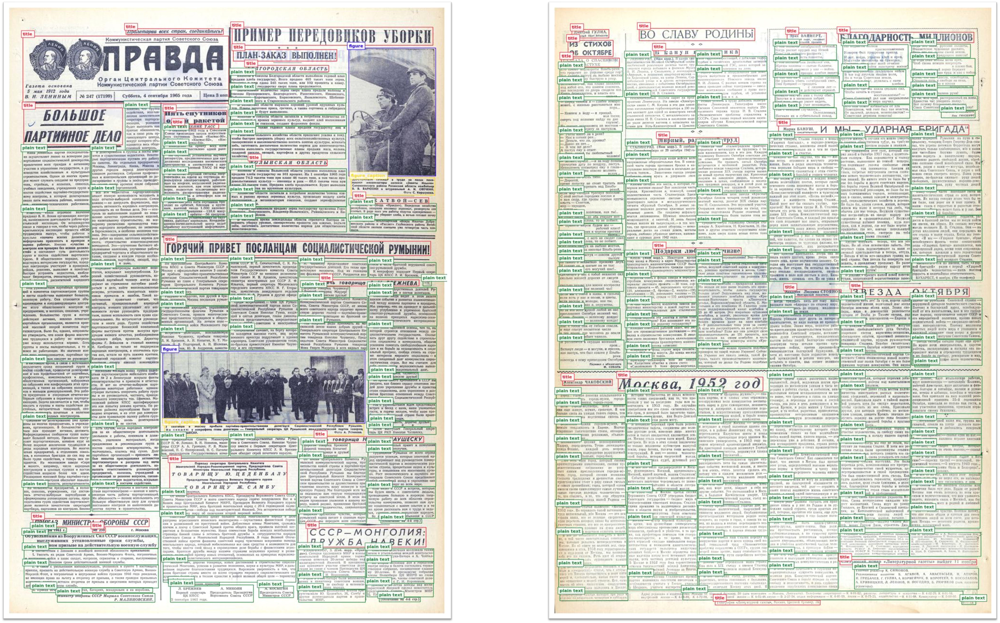

[]([http://arxiv.org/abs/2606.07661]

# PereStruct: Multimodal Semantic Assembly For Robust Historical Document Parsing

Automated pipeline for processing scanned pages of Soviet newspapers. The project solves the problem of extracting individual articles from continuous page text, using a combination of computer vision (YOLO), optical character recognition (OCR) and language model (YandexGPT) for error correction, as well as custom machine learning models for semantic article assembly.

## Features

1. **Block Detection (YOLO):** Automatic detection of headers and text blocks on images.
2. **Text Recognition (OCR):** Text extraction using Yandex Cloud OCR.
3. **Text Correction (LLM):** Correction of recognition errors (typos, word breaks) using YandexGPT while preserving historical stylistics.
4. **Article Assembly:** Combining scattered blocks into logical articles based on:
   * Semantic text similarity (TF-IDF).
   * Geometric block placement.
   * Visual features (YOLO Embeddings).
5. **Visualization:** Generation of images with articles marked in different colors.



## Comparison with Vision-Language Models

We evaluate PereStruct against state-of-the-art vision-language models (VLMs) on end-to-end article extraction from raw images to structured Markdown. PereStruct substantially outperforms both Qwen3.6-35B-A3B (35B parameters) and Qwen3.6-Plus (billion-scale proprietary model) across all metrics.

| Model | BLEU ↑ | ROUGE-1 ↑ | ROUGE-2 ↑ | ROUGE-L ↑ |
|:---|:---|:---|:---|:---|
| Qwen3.6-35B-A3B | 0.1189 | 0.3935 | 0.1741 | 0.2838 |
| Qwen3.6-Plus | 0.3368 | 0.6284 | 0.3657 | 0.4875 |
| **PereStruct** | **0.9587** | **0.9613** | **0.9122** | **0.9160** |

## Datasets

This repository provides two datasets to support research on historical document parsing:

* **PereStruct Benchmark**: An annotated dataset of Soviet newspaper pages with ground-truth article groupings and corrected OCR texts for evaluation and testing.
* **YOLO Training Dataset**: Pre-processed layout detection data formatted for DocLayout-YOLO training, pre-split into train/validation/test sets. Available on [Zenodo](INSERT_ZENODO_LINK_HERE).


**PereStruct Benchmark Visualization**

## Project Structure

```text
PereStruct/
├── perestruct/          
│   ├── __init__.py         
│   ├── yolo.py                 # Block detection
│   ├── ocr.py                  # Text recognition
│   ├── correction.py           # LLM-based correction
│   ├── get_articles.py         # Article assembly and visualization
│   ├── pipeline.py             # Full pipeline
│   └── model/                  # Trained models directory
│       └── *.py                # Model modules
├── test/                       # Example images for testing
├── perestruct_benchmark/          
│   ├── images/                     # .jpg images
│   ├── evaluation/                 # Benchmarking results
│   └── dataset_reindexed.json      # Benchmark data
├── perestruct_classifier_train/    # Code for model training
├── requirements.txt                # Dependencies
└── README.md
```

## Installation

### 1. Environment Setup

```bash
git clone https://github.com/makSShandybo/PereStruct
cd PereStruct
conda create -n perestruct python=3.12
```

### 2. Install Dependencies

```bash
pip install -r requirements.txt
```

### 3. Configure API Keys

Yandex Cloud keys are required for OCR and correction.
Create a `.env` file based on the `env_example` template.

## Usage

### Quick Start

Run test.ipynb:

```python
from perestruct import run_full_pipeline

# Run processing
result_path = run_full_pipeline(
    images_dir="./data/newspapers",      # Folder with source JPGs
    output_dir="./results",              # Where to save results
    threshold=0.5,                       # Article assembly sensitivity threshold
    keep_intermediate=False              # True to save JSON for each stage
)

print(f"Processing complete!")
```

### Step-by-Step Execution

If you need to control each stage separately (step_by_step.ipynb):

```python
from perestruct.yolo import get_yolo_boxes
from perestruct.ocr import run_ocr
from perestruct.correction import run_correction
from perestruct.get_articles import ArticleAssembler

# 1. Detection
boxes = get_yolo_boxes('data/images')

# 2. OCR
run_ocr(boxes, output_file='step_ocr.json')

# 3. Correction
run_correction(input_path='step_ocr.json', output_path='step_corrected.json')

# 4. Assembly
assembler = ArticleAssembler(threshold=0.5)
assembler.process_file(
    input_json_path='step_corrected.json',
    output_json_path='final_result.json',
    viz_output_dir='viz_output'
)
```

## Output Format

The final JSON file contains a list of pages. Each page has a list of blocks with an added `article_id` field:

```json
[
  {
    "img_path": "/abs/path/to/image.jpg",
    "labels": [
      {
        "index": 0,
        "box_type": "title",
        "box_coord": {"x1": 0.1, "y1": 0.1, "x2": 0.9, "y2": 0.2},
        "text": "Original ocr text...",
        "text_corrected": "Corrected text...",
        "article_id": 0  <-- Article number this block belongs to
      },
      ...
    ]
  }
]
```

## Configuration and Parameters

| Parameter | Description | Default |
| :--- | :--- | :--- |
| `threshold` | Clustering threshold. Higher values (closer to 1.0) make the model stricter about merging blocks (more articles, but smaller). Lower values produce larger articles. | `0.5` |


## PereStruct Benchmark

The benchmark dataset follows a hierarchical JSON format representing newspaper pages and their annotated text blocks:

```json
[
  {
    "img_path": "1.jpg",
    "w": 4958,
    "h": 6808,
    "labels": [
      {
        "index": 0,
        "box_coord": {
          "x1": 0.846718,
          "y1": 0.53378,
          "x2": 0.980564,
          "y2": 0.62904
        },
        "box_type": "plain text",
        "article": "15",
        "text": "Raw OCR text with line breaks...",
        "text_corrected": "Cleaned and corrected text..."
      },
      ...
    ],
    "articles": {
      "15": [0, 15, 29, 73, ...],
      "1": [5, 6, 7, ...],
      ...
    }
  },
  ...
]
```

### Field Descriptions

**Page Level:**
- `img_path` — Filename of the source image (e.g., "1.jpg")
- `w`, `h` — Image dimensions in pixels (width, height)
- `labels` — Array of detected text blocks
- `articles` — Mapping of article IDs to arrays of block indices belonging to that article

**Block Level (within `labels`):**
- `index` — Unique block identifier (integer, sequential per page)
- `box_coord` — Normalized bounding box coordinates (0.0 to 1.0):
  - `x1`, `y1` — Top-left corner (normalized)
  - `x2`, `y2` — Bottom-right corner (normalized)
- `box_type` — Block category: `"plain text"`, `"title"`, `"figure"`, etc.
- `article` — Article ID (string) that this block belongs to; blocks sharing the same ID form one article (if Article ID = ? - block does not belong to any article)
- `text` — Raw OCR output (may contain line breaks `\n`, hyphens, artifacts)
- `text_corrected` — LLM-corrected text (cleaned line breaks, fixed hyphenation, preserved historical style)

### Coordinate System

All coordinates are normalized to image dimensions:
- `(0.0, 0.0)` = Top-left corner
- `(1.0, 1.0)` = Bottom-right corner
- To get pixel values: `x_pixel = x1 * w`, `y_pixel = y1 * h`

### Article Grouping

The `articles` object provides ground-truth clustering:
- Keys are article IDs (strings)
- Values are arrays of block indices belonging to that article
- Blocks with the same `article` field value in the labels array belong to the same logical article
- Used for training positive/negative pairs in the classification models

## Evaluation Data Structure

The `evaluation/` folder inside perestruct_benchmark contains benchmark data and results for model comparison:

```
PereStruct/
└── perestruct_benchmark/  
    └── evaluation/
        ├── splitted_data.json          # Source data with train/test/val splits
        ├── src_images/                 # Test set images 
        ├── MD/                         # Reference ground-truth Markdown files
        ├── PereStruct/                 # PereStruct model outputs
        │   ├── *.md                    # Reconstructed articles in Markdown
        │   └──── results/ 
        │         ├── final_result.json # Final PereStruct predictions for test set                
        │         └── visualizations/   # Visualization of predictions in .jpg format
        └── Qwen/                       # Qwen model baseline results
            └── *.md                    # Markdown outputs from Qwen model
```


## YOLO Training Data

Pre-processed dataset for pre-training the layout detection model (DocLayout-YOLO) is available on Zenodo:

**Download:** [ZENODO_LINK]

The dataset is already split into `train/`, `val/`, and `test/` folders and formatted for YOLO training:
```
yolo_dataset/
├── dataset.yaml         # Classes description 
├── train/
│   ├── images/          # .jpg files
│   └── labels/          # .txt files (YOLO format: class x_center y_center width height)
├── val/
│   ├── images/
│   └── labels/
└── test/
    ├── images/
    └── labels/
```


**PereStruct fine-tuned YOLO Predictions**

## Data Requirements

*   **Images:** `.jpg`, `.jpeg` formats.
*   **Text Language:** Russian (Soviet press).
